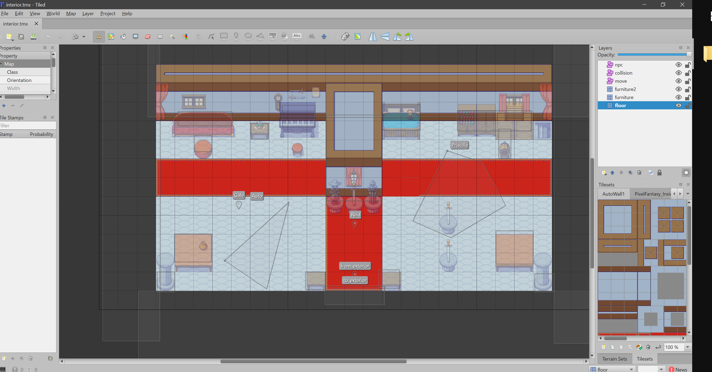
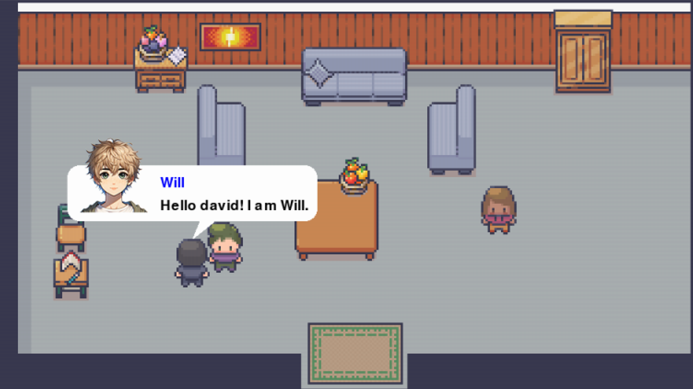
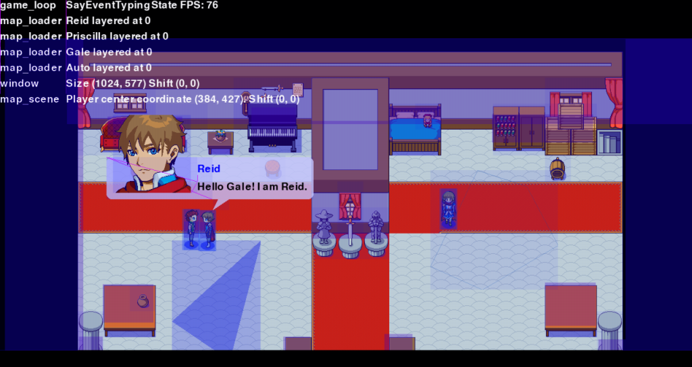
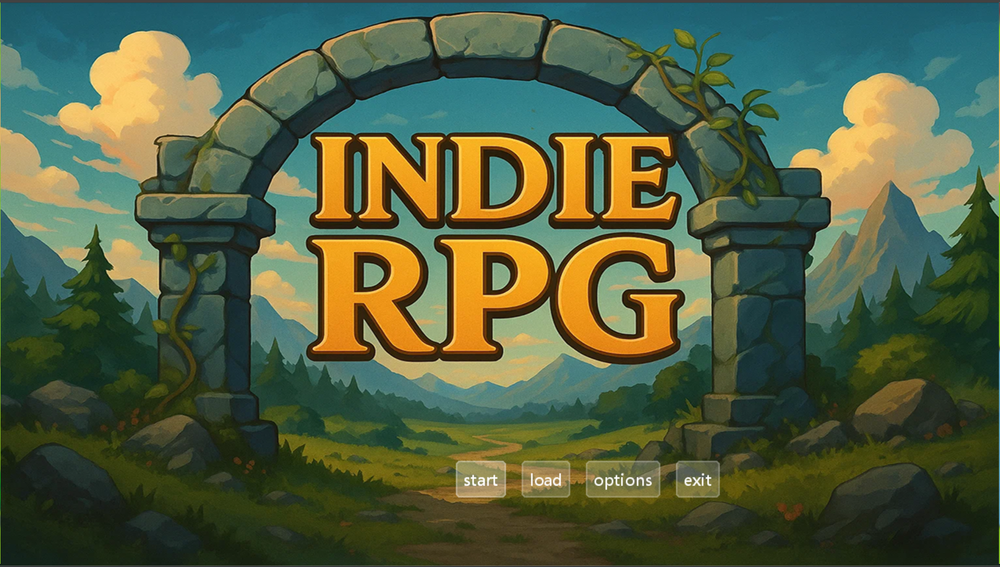
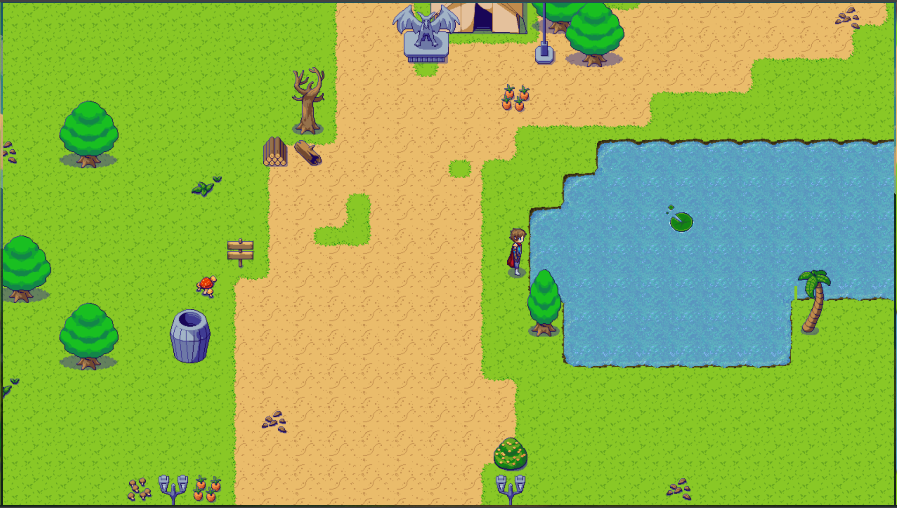
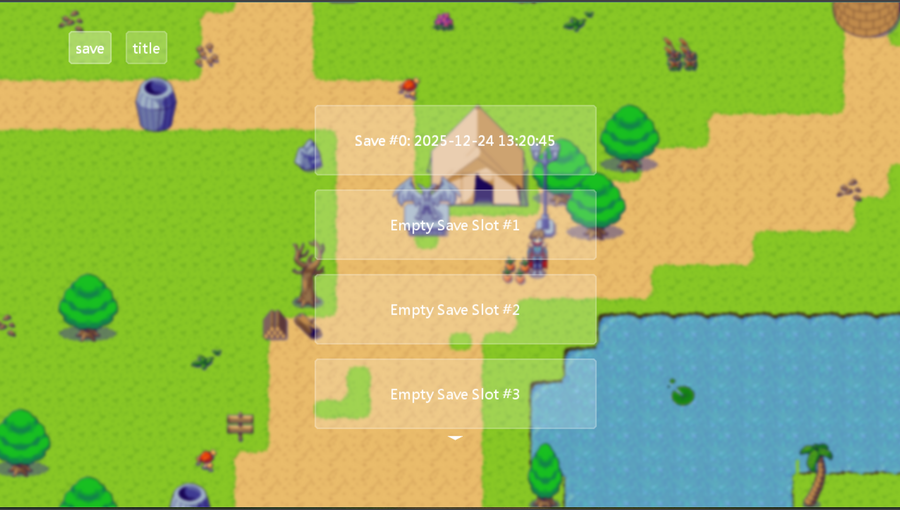

# nextrpg


Build your next RPG (Role Playing Game).

```
pip install nextrpg
```

## Example

Bring up Tiled map editor...



And turn your Python code (Yes, what comes after `:` are "type
hints"!)

```python
npc: "Nice to meet you! What's your name?"
player[AvatarPosition.RIGHT]: f"Hello {npc.name}! I am {player.name}."
```

into an RPG game scene! See the full
example: [example/scene/interior_scene.py](example/scene/interior_scene.py)



Plus, the debug information is just one-click away (by default, F3).



## Screenshots





