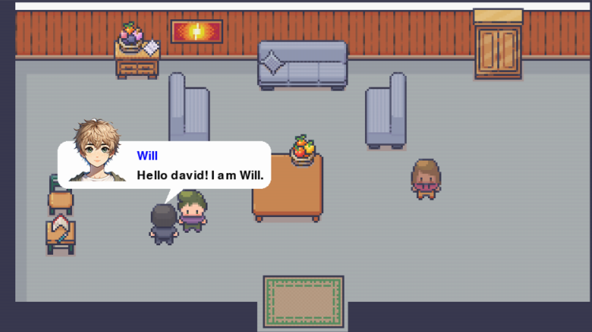

# nextrpg


Build your next RPG (Role Playing Game).

## Example

Turn your Python code

```python
npc: "Nice to meet you! What's your name?"
player: f"Hello {npc.display_name}! I am {player.display_name}."
```

into an RPG game scene!


Take a look at [
`interior_scene.py`](https://github.com/yx-z/nextrpg/blob/main/example/interior_scene.py#L24)
for details :)